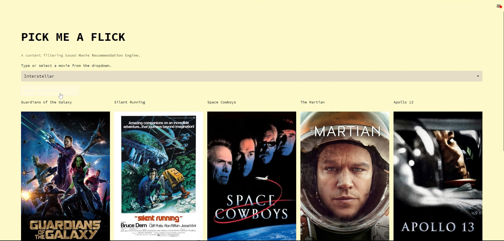

<h1 align="center">
   
  
   
  PICK ME A FLICK
   
</h1>

<h4 align="center">A content filtering based movie recommendation engine that uses cosine-similarity metric to recommend five most similar movies for a given movie, based on tags corresponding to the movies.</h4>

## How To Use

## Feedback

If you have any feedback, please reach out to me at shubham3279@gmail.com . I'd really appreciate it.

## Credits

This app uses the following open source packages:

- [Streamlit](http://electron.atom.io/)
- [SciLitLearn](https://nodejs.org/)
- [Marked - a markdown parser](https://github.com/chjj/marked)
- [showdown](http://showdownjs.github.io/showdown/)
- [CodeMirror](http://codemirror.net/)
- [highlight.js](https://highlightjs.org/)
		  

---

> GitHub [@shubham3279](https://github.com/shubham3279) &nbsp;&middot;&nbsp;
> Twitter [@shubham3279_](https://twitter.com/shubham3279_)

